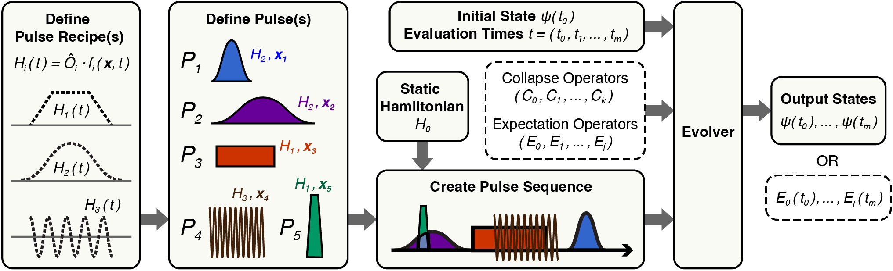

# Summary

TEMPO (Time-dependent Evolution of Multiple Pulse Operations) offers accessible and efficient simulations of pulse sequences in Python, using the suite of master equation solvers available in the Quantum Toolbox in Python (QuTiP). 
It enables straightforward definition of pulse sequence structures, including any underlying time-dependent Hamiltonians and pulse timing information, and faster simulations of pulse sequence dynamics (compared to naive implementations using QuTiP) while remaining compatible with the existing collection of QuTiP subpackages. Given the ubiquitous use of pulse sequences throughout quantum information/computing sciences, magnetic resonance studies, and quantum metrology, this work has immediate relevance to a wide array of research applications.

# Statement of Need
Pulse sequences typically contain a series of discrete operations (pulses) using radio frequency, microwave, or optical fields. Their application for quantum control has an extensive history across atomic physics [@Vitanov2001]; nuclear magnetic resonance [@Levitt2013]; solid-state spin systems for quantum sensing [@Barry2020]; and a broad range of other platforms.
In recent years, research into quantum technologies has driven the development of advanced software tools for numerical simulations of quantum systems [@Fingerhuth2018]. 
In particular, the QuTiP (Quantum Toolbox in Python) framework provides open-source tools for simulations of open quantum systems, and has received prolific use across numerous quantum applications [@Johansson2012; @Johansson2013]. Utilizing the master equation solvers that are native to QuTiP, TEMPO provides two key advantages for numerical simulations of pulse sequence dynamics.

**Ease of Use:** By incorporating both the characteristics of a Hamiltonian and its time constraints as necessary properties, pulses are first constructed individually, then collated to form a 'pulse sequence'. 
Time evolution is performed without the need to manually deactivate each pulse Hamiltonian outside its given time interval.
Using pulse 'recipes' in TEMPO, the creation of pulses with overlapping functional forms is streamlined, with parameters that can be tuned for individual pulses.

**Faster Executions of Time Evolution:** 
TEMPO organizes each pulse sequence as a series of time segments, preserving only the pulses that are active within each segment.
This avoids overheads incurred by repeated inspections of inactive pulse(s), significantly speeding up evaluation of system evolution.

![Outline of steps in TEMPO used to perform time evolution due to a pulse sequence. First, each pulse recipe contains the functional form of a time-dependent Hamiltonian $H_i(t) = \hat{O}_i \cdot f_i(\mathbf{x}, t)$. Pulse recipe(s) are used to create individual pulse(s) $P_1, \dots, P_n$, with individual parameter settings $\mathbf{x_1}, \dots, \mathbf{x_n}$, respectively. The pulses are organized into a sequence along with an optional static Hamiltonian. Next, the pulse sequence is provided to the Evolver, with an initial system state $\psi(t_0)$ and an array of evaluation times $(t_0, t_1, \dots, t_m)$. Time evolution returns the state $\psi(t_0), \dots, \psi(t_m)$ at these times; if operators $E_0, \dots, E_j$ are provided, the operator expectation values $E_0(t_0), \dots, E_j(t_0)$ are calculated instead. \label{fig:1}](TEMPO_Fig1.png)

<!--
<figure>
    
    <figcaption>
    This is the image caption
    </figcaption>
</figure>
-->

# Usage

There are five main classes that make up a simulation in TEMPO: `Pulse_Recipe`, `Pulse`, `Hamiltonian`, `Pulse_Sequence`, and `Evolver`.
In general, simulations can be easily executed by following the steps outlined below, which are illustrated in \autoref{fig:1}.

1. Create a pulse recipe by defining the functional form of the time-dependent Hamiltonian $$\hat H_i(t) = \hat O_i \cdot f_i(\mathbf{x},  t).$$ The user provides an operator/matrix $\hat O$ and scalar function $f(\mathbf{x}, t)$ that depends on input parameters $\mathbf{x}$ and time $t$.

1. Create individual pulse(s) $P_1, \dots, P_n$ by providing a pulse recipe, individual parameter settings $\mathbf{x_1}, \dots, \mathbf{x_n}$, and pulse timing information.

1. Generate a pulse sequence by inputting the pulses $P_1, \dots, P_n$, and optionally a time-independent (static) Hamiltonian.

1. To evolve the system in time, the pulse sequence is provided to the Evolver class along with the initial system state $\psi(t_0)$ (state vector or density matrix) and an array of time points $t_0, t_1, \dots, t_m$. The system state is returned at these times. It is also possible to provide collapse operators for evolution using the Linbladian (open) master equation, along with operators for calculation of expectation values at these times.

1. The Evolver returns the system state $\psi(t_0), \dots, \psi(t_m)$ or operator expectation values at the times provided.

<!--
commented text
-->
[//]: # (This is a comment.)
[//]: # (This is a comment on a new line.)

![(a) Average simulation wall-clock time $T_S$ as a function of pulse sequence duration $\tau$ without using TEMPO, for number of pulses $n=5,10,20,50$, shown in shades of blue. Average simulation times using TEMPO are shown in red at high pulse number count $(n=50)$. Best-fit curves are displayed as dashed lines, with slope values plotted in (b) for measurements with TEMPO in red and without TEMPO (via QuTiP's mesolve function) in black. (c) Example visualization of pulse sequence segmentation performed by TEMPO, where $n=3$ pulses result in $2n-1=5$ time segments for solver evaluation. All measurements of $T_S$ are average values over 20 repeated runs. \label{fig:2}](TEMPO_Fig2.png)

<!-- commented text
<figure>
    
    <figcaption>
    This is the image caption
    </figcaption>
</figure>
-->

## **Efficient Simulation Times**:

Using the existing master equation solvers available in QuTiP, TEMPO provides significant speedups in simulations of multi-pulse sequences. Without TEMPO, the simulation (wall-clock) time $T_S$ generally follow a linear trend with respect to 1) the total duration of a pulse sequence $\tau$, and 2) the number of pulses $n$, roughly obeying $$T_S \propto n \cdot \tau.$$
This dependence is highlighted in \autoref{fig:2}(a), which shows measurements of the average simulation time with varying $\tau$. Each set of measurements, shown as points of the same color, is performed for a fixed number of pulses $n$. 
Without TEMPO (shades of blue), the fitted slope for each set of measurements increases with $n$, exhibiting a linear dependence as shown in \autoref{fig:2}(b). In contrast, the use of TEMPO (red) results in simulation times that are nearly independent of the number of pulses $n$, instead following $T_S \propto \tau$. As a result, the slope of each best-fit line using TEMPO stays roughly constant with respect to $n$, as shown in \autoref{fig:2}(b).

This advantage can be understood by considering how the solvers are constructed natively (without TEMPO). At each timestep during the pulse sequence, the solver typically inspects if each pulse is active at this time. This results in $n$ checks at each timestep and thus the rough linear dependence of $T_S$ with respect to $n$.

Instead, TEMPO first divides the pulse sequence into consecutive time segments for efficient time evolution, illustrated by an example in \autoref{fig:2}(c). By creating segment breaks at the start and end of each pulse, TEMPO preserves only the active pulses in each of the $2n-1$ segments. The solver is then executed consecutively across each segment, without any redundant checks of inactive pulses. As a result, simulation times are largely independent of $n$, besides minor overheads from repeated use of the solver.

# Related Pulse Sequence Simulation Software
Existing open-source software that offer compatibility with pulse sequence simulations include QuTiP-based packages such as SeQuencing [@Sequencing] and PULSEE [Candoli2023]. Other software suitable for open quantum simulations of pulse sequence dynamics include Qiskit Dynamics in Python [@Alexander2020; @Puzzuoli2023], QuantumOptics.jl in Julia for speed and scalability to large system sizes [@Kramer2018], and Spinach in MATLAB for nuclear magnetic resonance systems [@Hogben2011].

# Acknowledgements
We thank Saipriya Satyajit, Katrijn Everaert, Declan Daly, Kevin Olsson and John Blanchard for testing the package and providing feedback during development. This work is supported by, or in part by, the DEVCOM Army Research Laboratory under Contract Numbers W911NF1920181 and  W911NF2420143; the DEVCOM ARL Army Research Office under Grant Number W911NF2120110; the U.S. Air Force Office of Scientific Research under Grant Number FA95502210312; and the University of Maryland Quantum Technology Center.
